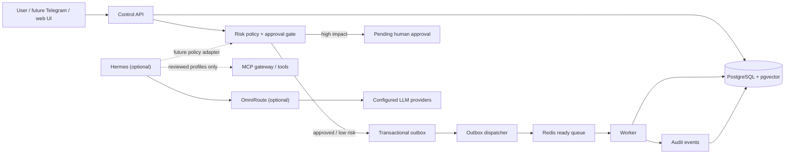

# autonomous-personal-agent

[](https://github.com/ReaperXD67/autonomous-personal-agent/actions/workflows/ci.yml)
[](LICENSE)

Security-first, self-hosted foundation for an autonomous personal agent. This
repository establishes durable task state, approval gates, audit events,
containerized workers, persistent memory storage, model-routing boundaries,
and a curated MCP policy layer before broad autonomy is enabled.

> **Foundation status:** core infrastructure works locally. Email, job
> applications, Telegram, browser automation, coding agents, and unrestricted
> MCP access are planned—not implemented.

## Why this exists

Personal agents can read hostile content and invoke powerful tools. Building
features first and controls later creates an unsafe system. This project starts
with explicit trust boundaries, least privilege, durable state, observability,
and human approval for high-impact actions.

## Implemented now

| Capability | Status | Notes |
|---|---|---|
| Container-first local stack | Implemented | Docker Compose; no project Python, Node, Redis, or PostgreSQL install on Windows |
| Control API | Implemented | Bearer-authenticated task submission, status, metrics, approval decisions |
| Dispatcher + worker | Implemented | Transactional outbox delivery plus deterministic `foundation.echo` lifecycle handler |
| Approval policy | Implemented | High-risk and destructive tasks enter `pending_approval` |
| Durable task/audit state | Implemented | PostgreSQL 17 + pgvector; state, audit, and outbox writes share transactions |
| Queue/cache | Implemented | Password-protected Redis 8 with AOF persistence |
| Hermes + OmniRoute | Prepared | Optional, official release-pinned Compose profile; onboarding still required |
| MCP policy architecture | Implemented | Curated registry, agent profiles, risk classes; no MCP server enabled by default |
| Full autonomous features | Planned | See [roadmap](docs/roadmap.md) |

## Architecture



Core stack runs without an LLM key. Optional `agent` profile is isolated from
PostgreSQL and receives only model-network access plus normal outbound access.

## Quick start: Windows + Docker Desktop

Prerequisites: Docker Desktop with Linux containers and Compose v2. PowerShell
is already part of Windows.

```powershell
git clone https://github.com/ReaperXD67/autonomous-personal-agent.git
cd autonomous-personal-agent
./scripts/init-env.ps1
./scripts/up.ps1
./scripts/health.ps1
./scripts/smoke.ps1
```

Open health endpoint at `http://127.0.0.1:8080/health/ready`. PostgreSQL and
Redis have no published host ports.

Stop cleanly:

```powershell
./scripts/down.ps1
```

## Useful commands

| PowerShell | Make | Purpose |
|---|---|---|
| `./scripts/init-env.ps1` | `make init` | Create ignored `.env` with random local secrets |
| `./scripts/up.ps1` | `make up` | Build and start core stack |
| `./scripts/health.ps1` | `make health` | Check container and dependency readiness |
| `./scripts/smoke.ps1` | `make smoke` | Verify safe path and approval-gated path |
| `./scripts/test.ps1` | `make test` | Run lint and tests in isolated container |
| `./scripts/logs.ps1` | `make logs` | Follow bounded Docker logs |
| `./scripts/backup.ps1` | `make backup` | Create ignored PostgreSQL custom dump + SHA-256 |
| `./scripts/down.ps1` | `make down` | Stop stack without deleting volumes |

## Optional Hermes + OmniRoute profile

```powershell
./scripts/up.ps1 -Agent
```

This starts release-pinned upstream images and binds dashboards to loopback:

- OmniRoute: `http://127.0.0.1:20128`

Hermes dashboard is intentionally not published. Current upstream requires an
auth provider for any non-loopback container bind; configure that first, then
add a reviewed authenticated dashboard override. Do not weaken this guard.

Complete OmniRoute onboarding, create a scoped inference key, store it only in
ignored `.env`, then configure Hermes using
[services/hermes/config.example.yaml](services/hermes/config.example.yaml).
Until this is done, image health can pass but model inference is not ready.

## Security defaults

- Secrets are generated locally and ignored by Git.
- Published ports bind to `127.0.0.1` only.
- PostgreSQL and Redis live on an internal Docker network.
- Application containers run as non-root, read-only, without Linux capabilities.
- High-risk and destructive tasks require an explicit approval record.
- Audit metadata stores keys and outcomes, not raw secrets or request bodies.
- Hermes receives no Docker socket or host filesystem mount.
- MCP registry starts disabled; each server needs review and scoped credentials.

This is not safe for public internet exposure without TLS, authenticated reverse
proxy, rate limiting, secret management, and VPS hardening described in the
[deployment guide](docs/operations/deployment.md).

## Data and persistence

| Data | Store | Durability |
|---|---|---|
| Tasks, approvals, audits | PostgreSQL | Authoritative, backed up |
| Long-term memory and embeddings | PostgreSQL + pgvector | Authoritative, backed up |
| Ready queue, cache, transient state | Redis | Recoverable; AOF enabled, not authoritative |
| Hermes state | `hermes_data` volume | Optional; back up after onboarding |
| OmniRoute configuration | `omniroute_data` volume | Optional; contains credentials, encrypt backups |

Named volumes survive `docker compose down`. Never run `down --volumes` unless
intentional data deletion is acceptable and backups were verified.

## Repository map

```text
config/postgres/init/     versioned database bootstrap schema
docs/                     architecture, ADRs, operations, security, roadmap
engineering/              factual build and validation journal
mcp/                      curated tool registry, profiles, permission policy
scripts/                  Windows-first lifecycle and verification commands
services/control-api/     control API, outbox dispatcher, and worker image
services/hermes/          verified upstream integration boundary
services/omniroute/       verified upstream integration boundary
tests/                    repository security/Compose contracts
```

## Documentation

- [Architecture overview](docs/architecture/overview.md)
- [Component boundaries](docs/architecture/components.md)
- [Networking](docs/architecture/networking.md)
- [Task and data flows](docs/architecture/data-flow.md)
- [Security baseline](docs/security/security-baseline.md)
- [Threat model](docs/security/threat-model.md)
- [MCP security](docs/security/mcp-security.md)
- [Local operations](docs/operations/local-development.md)
- [Engineering journal](engineering/ENGINEERING_JOURNAL.md)

## License

[MIT](LICENSE)
