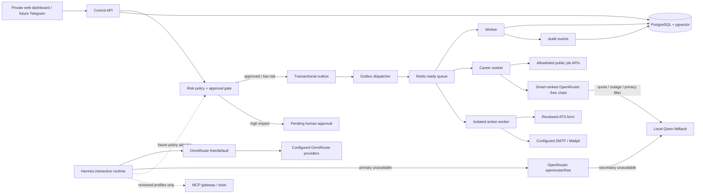
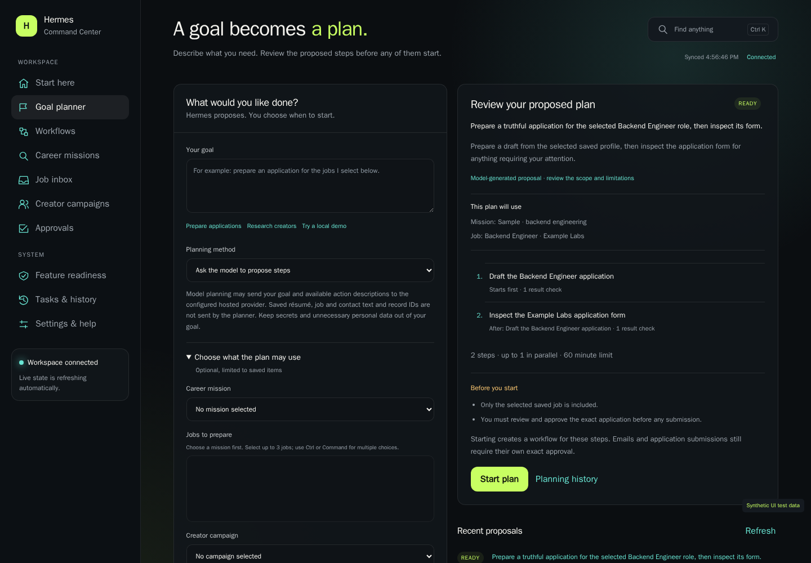

<div align="center">


</div>

[](https://github.com/ReaperXD67/autonomous-personal-agent/actions/workflows/ci.yml)
[](LICENSE)
[](#implemented-now)

**A control plane for useful autonomy: durable work, explicit approvals, and an audit trail by default.**

This is a security-first, self-hosted foundation for an autonomous personal agent. This
repository establishes durable task state, approval gates, audit events,
containerized workers, persistent memory storage, model-routing boundaries,
and a curated MCP policy layer before broad autonomy is enabled.

> [!IMPORTANT]
> **Local-alpha status:** the private web dashboard, scheduled fresh-job
> discovery, matching, tracking, local application drafting, exact-action review,
> isolated single-page ATS submission, and test-sink email work. Career Play can
> authorize bounded automatic applications within an explicit, expiring scope;
> manually prepared actions and creator emails retain exact-action approval. Telegram,
> generic browser automation, coding workers, and broad MCP access are not
> enabled. Never expose the dashboard port directly to the internet.
> The Linux VPS commands prepare a private single-operator deployment reached
> through SSH/VPN; they do not turn this alpha into a public multi-user service.

## Why this exists

Personal agents can read hostile content and invoke powerful tools. Building
features first and controls later creates an unsafe system. This project starts
with explicit trust boundaries, least privilege, durable state, observability,
and human approval for high-impact actions.

## Implemented now

| Capability | Status | Notes |
|---|---|---|
| Container-first local stack | Implemented | Docker Compose; no project Python, Node, Redis, or PostgreSQL install on Windows |
| Control API | Implemented | Bearer-authenticated task submission, status, metrics, approval decisions |
| Guided private dashboard | Implemented | Start-here guidance, goal proposals, feature readiness, searchable keyboard navigation, labeled mobile navigation, progressive forms, and inline errors at `127.0.0.1:8080`; one-use launcher authentication |
| Dispatcher + worker | Implemented | Transactional outbox, owned leases, heartbeats, cancellation, delayed retries, dead letters, deterministic foundation handlers |
| Durable workflows | Implemented | Dependency-aware plans, parallel ready steps, explicit result checks, deadlines, restart recovery, cancellation, and dashboard recipes; at most 32 steps and 4 concurrent tasks |
| Reviewed goal planner | Implemented | A model proposes at most 8 server-defined actions using your explicitly selected context. Review the immutable steps before adoption; execution enters the existing task/policy/audit path. A clearly labeled local demo needs no model |
| Feature readiness | Implemented | Per-feature prerequisites, next actions, and timestamped local test evidence; authenticated operator reports are stored in PostgreSQL and expire as readiness proof after 24 hours |
| Career scout | Public adapters implemented; live coverage varies | Arbeitnow, optional Remotive, and configured Ashby, Greenhouse, and Lever boards; all required keywords, location constraints, and explicit publication-date provenance. Remotive's public feed is delayed 24 hours |
| Application preparation | Local verified; hosted canary verified | A live benchmark/capability-ranked, zero-cost-only OpenRouter chain tries the strongest privacy-compatible current candidates, switches on provider or invalid-output failure, then uses Qwen3 8B locally. The agent can auto-preflight common forms and prepare the exact action |
| Career Play/Pause | Implemented; external application proof pending | Choose preparation or authorize a bounded automatic run: fresh published listings, minimum fit, selected ATS hosts, rolling daily cap, expiry, profile binding, and duplicate prevention. Optional job-published hiring email shares the same limits |
| Application and reply tracker | Implemented; Gmail OAuth proof pending | Durable submission/reply/interview/outcome timelines, explicit review of uncertain matches, and a read-only labeled Gmail adapter. Unconfigured Gmail is shown as unavailable; interview times are never invented |
| Isolated application adapter | Verified with local fixture | Disposable Playwright container, reviewed ATS hosts, exact form signature, explicit unknown answers, durable receipt, no CAPTCHA/login bypass |
| Email sender | Verified with Mailpit; external SMTP unconfigured | Exact approval, durable SMTP acceptance, and PostgreSQL-backed external pacing: 15-minute global/30-minute same-domain gaps, rolling 3/hour and 12/day caps, and jitter |
| Creator research and outreach | Research verified; external send pending | Multi-page discovery with a durable shared search budget, published business-contact evidence, fit explanations, collaboration concepts, country/language selectors, coverage counts, paged shortlist and complete campaign CSV export. Strict Poland selection requires a channel-declared PL country; discovery does not authorize outreach |
| Approval policy | Implemented | High-risk and destructive tasks enter `pending_approval` |
| Durable task/audit state | Implemented | PostgreSQL 17 + pgvector; state, audit, and outbox writes share transactions |
| Queue/cache | Implemented | Password-protected Redis 8 with AOF persistence |
| Hermes model hierarchy | Provider canaries verified; forced failover prepared | Managed OmniRoute `free/default` → OpenRouter `openrouter/free` → internal Qwen; OmniRoute and OpenRouter each passed harmless live requests |
| Local inference | Verified; lazy lifecycle added | Pinned Ollama + Qwen3 8B returned `LOCAL_MODEL_OK` on the observed 8 GB NVIDIA GPU; normal startup keeps weights unloaded |
| Free hosted routing | Verified live | Live benchmark/capability ranking, active-ZDR endpoint checks, a provider-valid four-model chain, no-training/ZDR defaults, zero-cost response attestation, PostgreSQL usage audit, daily headroom, and local continuity |
| MCP policy architecture | Implemented | Curated registry, agent profiles, risk classes; no MCP server enabled by default |
| Supply-chain CI | Implemented | Required dependency review, Trivy repository/image gates, immutable actions, SPDX runtime SBOM |
| Private VPS operations | Prepared; host proof pending | Fail-closed deployment, systemd boot/recovery, provider-health timer, checksummed backup, and restore drill; dashboard stays loopback-only |
| External submission and messaging | Prepared/partially verified | Local end-to-end side effects pass; real ATS/provider compatibility and credentials remain manual gates |

## Architecture



The policy/task core can still run without an LLM key. The normal dashboard
launcher enables the isolated `agent` profile; Hermes remains outside
PostgreSQL and receives only model-network access plus normal outbound access.

## Quick start: Windows + Docker Desktop

Prerequisites: Docker Desktop with Linux containers and Compose v2. PowerShell
is already part of Windows.

```powershell
git clone https://github.com/ReaperXD67/autonomous-personal-agent.git
cd autonomous-personal-agent
./scripts/init-env.ps1
./scripts/open-dashboard.ps1 -SideEffectsTest
```

The command starts and checks the stack, opens `http://127.0.0.1:8080`, and
authenticates the browser with a 90-second one-use URL fragment. The fragment is
removed immediately and exchanged for an HttpOnly session; the long-lived
control token is neither copied nor stored by browser JavaScript. Email goes to
Mailpit and applications go only to the fake site. PostgreSQL, Redis, and Ollama
have no published host ports. Qwen stays unloaded unless both hosted routes
fail. Add `-LocalModel` only when deliberately testing that final fallback.

Create a career mission, paste résumé text, add your application identity and
portfolio link, and choose titles, skills, locations, and supported source boards.
The freshness default is 72 hours and can be set from 1 to 168 hours. **Play**
opens the run scope: preparation is the default, while automatic application mode
requires explicit authorization of its hosts, score, cap, and expiry. The default
limit is three applications per rolling 24 hours and a 24-hour authorization;
the configurable maxima are ten applications and seven days. **Pause** withdraws
the run's authority; an application already submitted remains in its history.

Automatic applications require publication evidence, a prepared truthful draft,
and supported forms with known answers. An update timestamp alone does not prove
a new job. If enabled explicitly, a job's one unambiguous published hiring email
can receive an application through configured SMTP; ATS and email share a daily
cap and one-application-per-job guard. This does not authorize general cold
outreach. Unsupported forms, unknown required answers, and changed context stop
for review. Work enters the existing task, policy, audit, and receipt path.

Use **Application tracker** for submissions, reviewed replies, interviews, and
outcomes. The Gmail adapter reads only its configured career label and keeps
uncertain matches for review. It is prepared but needs local OAuth configuration
and a real canary before it can be called operational. LinkedIn, Y Combinator,
and Discord account automation is not connected; use a discovered employer's
supported ATS board instead of assuming those accounts are being monitored.
See the
[dashboard and career guide](docs/operations/dashboard-and-career.md).

The **Start here** page suggests the next action based on approvals, ready plans,
running work, and new matches. **Goal planner** lets you describe an outcome and
select the mission, up to three jobs, or campaign it may use. Inspect the proposed
steps and limitations, then choose **Start plan**. The local demo demonstrates
that complete review-to-result loop without a provider account. Use **Feature
readiness** for setup requirements and recorded test results; **Ctrl/Cmd+K** opens
the searchable navigation menu. See the [guided workspace guide](docs/operations/guided-workspace.md).



*Illustrative screenshot using synthetic sample data. Real local execution is
verified separately by the feature gate; the interface does not imply AGI.*

To recheck implemented local features and publish safe evidence to the dashboard:

```powershell
./scripts/feature-test.ps1 -PublishReport
```

This includes containerized checks, crash/concurrency probes, restore, configured
model canaries, job drafting, bounded YouTube discovery when configured, the live
goal proposal path, and local application/email fixtures. Reports contain only
allowlisted check metadata and configuration booleans. They do not certify real
SMTP delivery, every external ATS, VPS deployment, or roadmap integrations.

Open **Workflows** to coordinate several tasks into one durable plan. The safe
demo verifies a message, runs two independent branches, and checks the final
result without a model or provider account. The application recipe generates a
draft before inspecting the selected form, and checks both results. A failed
check blocks dependent steps; independent branches can finish. Plans resume from
PostgreSQL after restart and have explicit time and concurrency limits.
See the [workflow guide](docs/operations/workflows.md) for recipes and API examples.

Local Qwen is the default for career drafting. To opt into stronger hosted free
drafting without putting a key in Git or shell history, create a dedicated
OpenRouter inference key and run:

```powershell
./scripts/openrouter.ps1 -Configure
./scripts/openrouter.ps1 -Smoke
```

The key prompt is hidden. The runtime accepts only current text models whose
exact ID ends in `:free`, whose catalog prices are all zero, and whose response
reports zero cost. It intersects that set with active zero-retention endpoints,
ranks candidates by live benchmark metadata plus capabilities/context, and sends
one primary plus no more than OpenRouter's three allowed fallbacks. An explicit
`OPENROUTER_MODEL_PRIORITY` still overrides that quality order. A completion
that is empty or fails the application schema is cooled and the next ranked
model gets its own accounted attempt before local fallback. The dashboard
**Settings** view shows the selected model/provider, fallback attempt, daily
usage, privacy mode, and recorded cost. Hosted drafting sends résumé/job text to
OpenRouter and an upstream provider; leave it disabled to keep all drafting
on-device.

For KarixMC promotion, run `./scripts/promotion.ps1` for a secret-safe readiness
check, then open **Creator campaigns**. Each campaign now produces ready-to-copy
YouTube, Discord, Reddit/community, and partner promotion assets with distinct
UTM links at no provider cost. Official discovery needs a restricted user-owned
YouTube key and now extracts unreviewed business-contact candidates from public
channel/video descriptions. Research includes source excerpts, fit explanations,
video evidence, creative collaboration ideas, and explicit gaps. The YouTube
shortlist supports search, contact filters, individual refresh, and CSV export.
Country and language rules can accept any metadata, prefer a target, or require
it strictly. **Poland only** requires the channel to declare PL; unknown countries
are excluded rather than inferred from a name or search region. Published
language metadata is evaluated separately. This proves neither nationality nor
the location of viewers. Excluded saved prospects remain available as history.
Review each contact source before authorizing outreach; every individual creator email
remains exact-approval gated. External SMTP approvals reserve a
durable low-volume slot, so several approvals cannot become a restart-time burst.
Pacing reduces reputation risk but cannot guarantee inbox placement. See the
[creator outreach guide](docs/operations/creator-outreach.md).

Prove the creator workflow locally before configuring or using external mail:

```powershell
./scripts/promotion.ps1 -LocalTest
```

It creates only synthetic campaign/contact data, generates the five promotion
assets and one exact introduction, approves delivery to Mailpit, verifies a
durable opt-out, and removes its PostgreSQL records. It makes no YouTube API
request, sends no external email, and does not pass saved SMTP credentials into
the test containers.

Before using any real destination, prove the side-effect path entirely locally:

```powershell
./scripts/side-effect-smoke.ps1
```

The disposable test submits only to a fake ATS inside Docker and sends only to
Mailpit at `http://127.0.0.1:8025`.

Stop cleanly:

```powershell
./scripts/down.ps1
```

## Private Linux VPS deployment

The supported first VPS shape is one dedicated Linux host with the dashboard
still bound to `127.0.0.1`. After hardening the host and checking out an exact
reviewed commit or release tag:

```bash
./scripts/vps-init-env.sh
# Add only the provider credentials you intentionally enable, then:
./scripts/vps-preflight.sh
./scripts/vps-up.sh
./scripts/vps-install-service.sh
./scripts/vps-backup.sh
./scripts/vps-restore-drill.sh
```

Connect from your workstation with
`ssh -L 8080:127.0.0.1:8080 deploy@YOUR_VPS`, run
`./scripts/vps-dashboard-login.sh` on the VPS, and open the one-use URL it
prints. Full startup always includes the model hierarchy; a new VPS can use
`./scripts/vps-up.sh --bootstrap-omniroute` before its scoped OmniRoute key
exists. `--local-model` performs an explicit Qwen canary and is not required for
normal operation. Real side effects are controlled by
`VPS_SIDE_EFFECTS_ENABLED=true` only after TLS SMTP is configured. See the
[VPS deployment guide](docs/operations/deployment.md).

## Useful commands

| PowerShell | Make | Purpose |
|---|---|---|
| `./scripts/init-env.ps1` | `make init` | Create ignored `.env` with random local secrets |
| `./scripts/up.ps1` | `make up` | Build and start core stack |
| `./scripts/open-dashboard.ps1 -SideEffectsTest` | `make dashboard` | Start the full agent hierarchy, safe side-effect fixtures, and an auto-authenticated private dashboard |
| `./scripts/health.ps1` | `make health` | Check container and dependency readiness |
| `./scripts/smoke.ps1` | `make smoke` | Verify safe path and approval-gated path |
| `./scripts/career-smoke.ps1 -Draft` | `make career-smoke` | Verify live fresh-job ingestion and a local structured draft using disposable synthetic data |
| `./scripts/side-effect-smoke.ps1` | `make side-effect-smoke` | Verify local ATS submit, local email, exact approvals, and duplicate refusal with disposable data |
| `./scripts/creator-outreach-smoke.ps1` | `make creator-outreach-smoke` | Verify synthetic creator campaign, promotion kit, exact Mailpit introduction, metrics, and suppression |
| `./scripts/creator-research-smoke.ps1` | — | Prove research persistence, reviewed-contact isolation, and suppression in a disposable PostgreSQL database |
| `./scripts/promotion.ps1` | — | Show secret-safe YouTube/SMTP/Docker promotion readiness and exact next steps |
| `./scripts/promotion.ps1 -LocalTest` | — | Start Docker if needed and run the creator-specific no-egress proof |
| `./scripts/promotion.ps1 -ConfigureSMTP` | — | Configure an existing SMTP provider through local prompts with a hidden password; save settings atomically |
| `./scripts/promotion.ps1 -CheckSMTP` | — | Queue an audited fixed-provider connection/TLS/authentication check; send no email |
| `./scripts/promotion.ps1 -OpenDashboard` | — | Start Docker if needed and open an auto-authenticated promotion-capable dashboard |
| `./scripts/up.ps1 -SideEffects` | `make side-effects-up` | Start the isolated browser/email executor for configured real destinations |
| `./scripts/recovery-smoke.ps1` | `make recovery-smoke` | Verify expired leases retry and exhaust safely |
| `./scripts/lifecycle-smoke.ps1` | `make lifecycle-smoke` | Verify queued/running cancellation and dead-letter inspection |
| `./scripts/workflow-smoke.ps1` | — | Prove dependencies, result checks, approvals, cancellation, deadlines, rollback, and concurrent reconciliation in a disposable database |
| `./scripts/agent-smoke.ps1` | `make agent-smoke` | Verify configured OmniRoute model inference |
| `./scripts/openrouter.ps1 -Smoke` | `make openrouter` | Verify the current ranked free-only chain with one harmless zero-cost request |
| `./scripts/test.ps1` | `make test` | Run lint and tests in isolated container |
| `./scripts/logs.ps1` | `make logs` | Follow bounded Docker logs |
| `./scripts/backup.ps1` | `make backup` | Create ignored PostgreSQL custom dump + SHA-256 |
| `./scripts/restore-drill.ps1` | `make restore-drill` | Restore into a random disposable database and validate it |
| `./scripts/down.ps1` | `make down` | Stop stack without deleting volumes |
| `./scripts/doctor.ps1` | `make doctor` | Diagnose Docker, WSL, configuration, services, GPU, and agent readiness |
| `./scripts/readiness.ps1` | `make readiness` | Run the complete core, restore, local/routed-model, and Hermes readiness gate |
| `./scripts/feature-test.ps1 -PublishReport` | — | Test implemented local features and publish safe, timestamped evidence to Feature readiness |
| `./scripts/planning-smoke.ps1 -Live` | — | Prove proposal isolation plus an accounted model proposal, reviewed adoption, and actual workflow result |
| `./scripts/scheduler-smoke.ps1` | — | Prove atomic rollback, concurrency, and idempotency conflicts in a disposable PostgreSQL database |
| `./scripts/vps-init-env.sh` | `make vps-init` | Create an owner-only production `.env` on Linux without provider credentials |
| `./scripts/vps-preflight.sh` | `make vps-preflight` | Refuse dirty, public-port, placeholder, test-mail, or privileged VPS configurations |
| `./scripts/vps-up.sh` | `make vps-up` | Start the private VPS stack and prove safe + approval-gated paths |
| `./scripts/vps-install-service.sh` | `make vps-install-service` | Install boot startup, failure recovery, and the provider-health timer |
| `./scripts/vps-dashboard-login.sh` | `make vps-dashboard-login` | Mint a 90-second one-use private dashboard URL without exposing the control token |
| `./scripts/vps-model-health.sh` | `make vps-model-health` | Check route order and all three model-provider endpoints without inference |
| `./scripts/vps-backup.sh` | `make vps-backup` | Create an owner-only PostgreSQL dump and SHA-256 sidecar |
| `./scripts/vps-restore-drill.sh` | `make vps-restore-drill` | Restore and validate a disposable VPS database, then remove it |

## Managed Hermes model profile

```powershell
./scripts/up.ps1 -Agent
```

This starts release-pinned upstream images and binds dashboards to loopback:

- OmniRoute: `http://127.0.0.1:20128`

Hermes dashboard is intentionally not published. Current upstream requires an
auth provider for any non-loopback container bind; configure that first, then
add a reviewed authenticated dashboard override. Do not weaken this guard.

This workstation is onboarded with a scoped inference-only key in ignored
`.env`; `free/default` and Hermes one-shot inference pass. A fresh clone still
requires local administrator onboarding and a new scoped key. Use
[services/hermes/config.example.yaml](services/hermes/config.example.yaml) as the
reviewed boundary and never treat image health alone as inference readiness.
The committed interactive route is ordered: OmniRoute `free/default`, then
OpenRouter `openrouter/free`, then local Qwen. Deterministic discovery/scoring
still uses no LLM. Career drafting keeps its stricter direct OpenRouter adapter:
it ranks the current verified-free/privacy-compatible pool, tries no more than
the provider's supported one-plus-three chain, and records usage in PostgreSQL.
General Hermes fallback calls use OpenRouter's capability-filtered free router
(which selects randomly among compatible candidates) and remain outside that
career ledger, so set a provider-side key limit and monitor account-wide
allowance.

## Complete test-readiness gate

After first boot, verify the complete configured workstation with one command:

```powershell
./scripts/readiness.ps1
```

It runs the full lifecycle suite, disposable database restore, environment
doctor, OmniRoute route, local GPU model, and Hermes one-shot request. A
secret-free machine-readable result is written to ignored
`runtime/readiness/latest.json`. See the [test-readiness guide](docs/operations/test-readiness.md).

## Completely local, no-token-cost inference

The observed RTX 4070 Laptop GPU has 8 GB VRAM. Current Nemotron 3 agentic
checkpoints are too large for it, so the local fallback is Qwen3 8B Q4:

```powershell
./scripts/local-model.ps1
```

This explicitly tests the digest-pinned Ollama/Qwen path, requires the exact
harmless response `LOCAL_MODEL_OK`, verifies GPU placement when NVIDIA is
available, and unloads Qwen afterward. Normal agent startup supervises only the
small Ollama daemon and caches a missing model; weights/GPU memory are loaded by
the first real fallback request and released after `LOCAL_MODEL_KEEP_ALIVE`.
This workstation passed the inference check on 2026-08-15. The fallback is
private and has no token bill, but its 8K configured context and model quality
are below strong hosted models.
Use OpenRouter free models for the secondary hosted route when available.
Hermes reaches Qwen only after OmniRoute and OpenRouter fail. The career worker
applies stronger benchmark ranking and zero-price/privacy/cost controls than the
interactive fallback, so the two consumers must be monitored separately.
See the [free-stack assessment](docs/research/free-agent-stack-2026-08.md),
[free-pool allocation assessment](docs/research/free-pool-allocation-2026-08.md),
and [remaining manual setup](docs/operations/manual-setup.md).

## Security defaults

- Secrets are generated locally and ignored by Git.
- Published ports bind to `127.0.0.1` only.
- PostgreSQL and Redis live on an internal Docker network.
- Application containers run as non-root, read-only, without Linux capabilities.
- High-risk and destructive tasks require an explicit approval record.
- Real side effects bind approval to a SHA-256 digest of the exact action and
  use a durable pre-click/pre-send receipt; they are never retried automatically.
- Career Play may authorize those exact packets within a stored, expiring grant.
  The final submission rechecks its scope, profile, freshness, budget, and pause
  state. This does not grant general tool, account, or messaging authority.
- External SMTP approval atomically reserves a PostgreSQL send slot with rolling
  hourly/daily caps, same-domain spacing, and jitter; the worker rechecks it at
  the send boundary. Mailpit fixtures remain immediate.
- Creator outreach revalidates contact provenance, authorization, suppression,
  and reply state immediately before SMTP. Learning can select only fixed draft
  variants and cannot send, spend, or change policy.
- Audit metadata stores keys and outcomes, not raw secrets or request bodies.
- Hermes receives no Docker socket or host filesystem mount.
- MCP registry starts disabled; each server needs review and scoped credentials.
- Required CI rejects new fixed high/critical dependency or runtime-image
  vulnerabilities and repository secret/misconfiguration findings.
- OpenAPI/schema discovery is disabled and Host headers are checked against an
  explicit allowlist; the VPS bootstrap restricts that allowlist to loopback.

This is not safe for public internet exposure without TLS, authenticated reverse
proxy, rate limiting, secret management, and VPS hardening described in the
[deployment guide](docs/operations/deployment.md).

## Data and persistence

| Data | Store | Durability |
|---|---|---|
| Tasks, approvals, audits | PostgreSQL | Authoritative, backed up |
| Career missions, matches, draft packs, form preflights | PostgreSQL | Authoritative, backed up; résumé text never enters task payloads/audits, but opt-in hosted drafting transmits it to the selected provider |
| Career run grants, shared application budgets, tracking events, and labeled-mail metadata | PostgreSQL | Authoritative; pause/expiry and duplicate guards survive restarts; inferred mailbox outcomes retain evidence and review state |
| Inference route/usage metadata | PostgreSQL | Authoritative; requested/selected models, provider, tokens, fallback, latency, privacy mode, and cost only—never prompt or output text |
| Exact external actions and side-effect receipts | PostgreSQL | Authoritative; approval digest and duplicate guard survive restarts |
| Creator campaigns, research dossiers, contact provenance, suppressions, messages, outcomes | PostgreSQL | Authoritative; public description contacts remain unreviewed evidence until separately authorized, and every creator send links to an exact action |
| Long-term memory and embeddings | PostgreSQL + pgvector | Authoritative, backed up |
| Ready queue, cache, transient state | Redis | Recoverable; AOF enabled, not authoritative |
| Hermes state | `hermes_data` volume | Optional; back up after onboarding |
| OmniRoute configuration | `omniroute_data` volume | Optional; contains credentials, encrypt backups |
| Local Ollama models | `ollama_data` volume | Optional; reproducible downloads, potentially large |

Named volumes survive `docker compose down`. Never run `down --volumes` unless
intentional data deletion is acceptable and backups were verified.

## Repository map

```text
config/postgres/init/     versioned database bootstrap schema
docs/                     architecture, ADRs, operations, security, roadmap
engineering/              factual build and validation journal
AGENTS.md                  durable rules for future coding agents
mcp/                      curated tool registry, profiles, permission policy
scripts/                  Windows local and Linux private-VPS lifecycle commands
services/control-api/     control API, outbox dispatcher, and worker image
services/action-worker/   isolated Playwright/SMTP runtime and locked dependencies
services/hermes/          verified upstream integration boundary
services/omniroute/       verified upstream integration boundary
tests/                    repository security/Compose contracts
```

## Documentation

- [Architecture overview](docs/architecture/overview.md)
- [Component boundaries](docs/architecture/components.md)
- [Networking](docs/architecture/networking.md)
- [Task and data flows](docs/architecture/data-flow.md)
- [Security baseline](docs/security/security-baseline.md)
- [Threat model](docs/security/threat-model.md)
- [Dependency risk register](docs/security/dependency-risk-register.md)
- [MCP security](docs/security/mcp-security.md)
- [Autonomous side-effect security review](docs/security/autonomous-side-effect-review.md)
- [Local operations](docs/operations/local-development.md)
- [Dashboard, job-hunt testing, and switching missions](docs/operations/dashboard-and-career.md)
- [Durable workflows, result checks, and recovery](docs/operations/workflows.md)
- [Creator discovery, outreach, results, and adaptation](docs/operations/creator-outreach.md)
- [Manual setup remaining](docs/operations/manual-setup.md)
- [Free agent/model research](docs/research/free-agent-stack-2026-08.md)
- [Engineering journal](engineering/ENGINEERING_JOURNAL.md)
- [System evolution](engineering/SYSTEM_EVOLUTION.md)
- [Experiment log](engineering/EXPERIMENT_LOG.md)

## License

[MIT](LICENSE)
