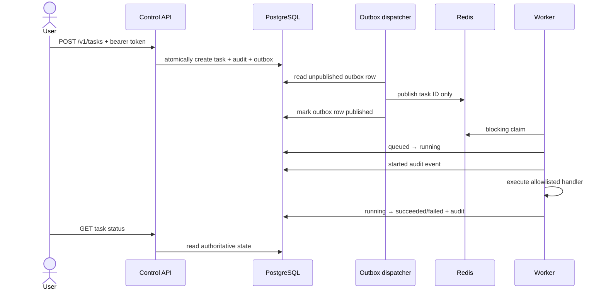

# Task and data flows

## Low/medium-risk task

## High/destructive-risk task

Creation stops at `pending_approval`; no outbox row is created. An authenticated
approver records `approved` or `rejected`. Approval atomically moves the task to
`queued`, writes its audit event, and creates its outbox row. The dispatcher then
publishes its ID. Database state prevents replayed queue items from re-running
completed work.

## State ownership

| State | Authority | Notes |
|---|---|---|
| Task lifecycle/result | PostgreSQL | Never inferred from queue length |
| Approval record | PostgreSQL | Immutable decision row plus task projection |
| Audit history | PostgreSQL | Redacted metadata; correlation-linked |
| Pending delivery | PostgreSQL outbox | Durable until published; safe to retry |
| Ready signal | Redis | May be reconstructed from queued tasks |
| Agent memory | PostgreSQL + pgvector | Planned writers require provenance and policy |
| Embeddings | pgvector column | Model/version metadata must accompany future writes |
| Logs | Docker log driver | Operational, rotated, not authoritative audit storage |

## Failure semantics

- Duplicate idempotency key returns existing task identity.
- Database commit before Redis publication is recovered from the durable outbox.
- Dispatcher delivery is at least once; duplicate signals are harmless.
- Stale Redis entry cannot transition non-queued task.
- Worker failure records bounded error metadata without secrets.
- Current worker does not yet reclaim tasks left `running` after process death;
  lease/reconciliation is a roadmap item.
