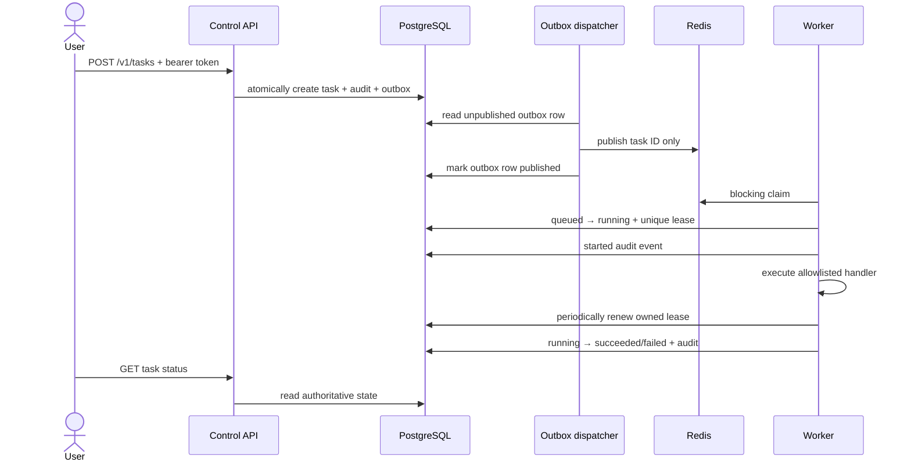

# Task and data flows

## Low/medium-risk task

Career tasks use the same sequence but the dispatcher routes their task IDs to a
dedicated Redis list and the career worker claims them. The caller supplies only
profile/opportunity IDs. The worker loads résumé data from PostgreSQL only when
drafting. Raw résumé text is absent from queue envelopes, task payloads, audit
metadata, and public job-source requests. Hosted drafting is explicit opt-in:
the worker reserves the daily call, sends résumé/job text only through the
preverified free/privacy route, records route metadata, and falls back locally
on any policy or availability failure.
The worker sorts new matches by score and publication time before selecting the
bounded auto-prepare set. Search, filtering, scoring, and form preflight remain
deterministic and consume neither hosted pool.

Hermes traffic follows a separate ordered chain: `free/default` through
OmniRoute, then OpenRouter `openrouter/free`, then internal `qwen3:8b`. Ollama
is reachable throughout, but Qwen weights remain unloaded until the final route
receives a request and are released after idle time. The direct career adapter
still applies stricter exact-model, privacy, zero-cost, and PostgreSQL
reservation policy; general Hermes OpenRouter calls do not join that ledger.

## Durable workflow

`POST /v1/workflows` validates an immutable acyclic plan and stores its steps,
deadline, idempotency hash, and audit in PostgreSQL. The dispatcher locks each
active workflow, observes child outcomes, checks exact top-level scalar result
fields, skips descendants of unsuccessful steps, and materializes ready tasks
through the existing capability policy and transactional outbox. Independent
branches continue within the plan's concurrency cap. No model output can select
a new tool, interpolate a payload, or modify the plan after creation.

Cancellation locks the workflow before its children, cancels undispatched and
queued work, and requests cooperative cancellation for running tasks. A plan
remains `cancelling` until those tasks finish or lease recovery resolves them.
Deadline expiry uses the same path and ends as `timed_out`; late completion is
not accepted as on-time success. Workflow-managed career handlers suppress their
usual automatic child preparation/action creation, keeping workflow tasks
inside the submitted plan. Independent career missions retain their existing
automatic preparation behavior.

## Career mission schedule

An active PostgreSQL profile holds `next_scan_at`. The career worker atomically
claims due profiles and advances the next schedule, then calls the same durable
task creation method as the API. Those two operations currently use separate
transactions: a crash between them can miss that occurrence, although the
mission and its future schedule remain durable. The task/outbox transaction is
committed before queue publication. Fresh source records are filtered and
upserted by profile/source key. Workflow dispatch uses a single transaction for
its task and step binding and does not share this schedule-advance gap.

## High/destructive-risk task

Creation stops at `pending_approval`; no outbox row is created. An authenticated
approver records `approved` or `rejected`. Approval atomically moves the task to
`queued`, writes its audit event, and creates its outbox row. The dispatcher then
publishes its ID. Database state prevents replayed queue items from re-running
completed work.

## Exact external action

Application preparation can run automatically: the career worker drafts the
pack and the action worker inspects a reviewed single-page form. Planning then
freezes the destination, form signature, submit label, resolved field values,
résumé/draft hashes, or email sender/recipient/subject/body into an expiring
PostgreSQL envelope. A SHA-256 digest binds that envelope to the task and
approval row.

After approval, the action worker revalidates the digest and referenced material.
For an application it reloads the form and refuses a changed signature. It
commits a unique receipt immediately before the final click/send. Completion
updates both receipt and action atomically. Any error after receipt creation is
`ambiguous`; there is no automatic retry. A second plan for the same opportunity
cannot click again because the application fingerprint is opportunity-scoped.

## Creator discovery and outreach

An active PostgreSQL campaign schedules `marketing.creator_discovery` through
the policy/outbox path. The research worker loads the campaign by ID, calls only
the official YouTube Data API, and upserts public channel/video metadata plus
deterministic relevance evidence. The API key never enters the task, queue,
audit, or dashboard. Discovery creates no contact authorization.

An operator separately records a public business email, its source URL, a basis
note, and an authorization timestamp. Planning freezes one sequence stage and
one draft variant into the generic exact email action. The action worker locks
the prospect and rechecks address, authorization, suppression, and the required
reply state before the pre-SMTP receipt. `do_not_contact` and bounce outcomes
clear authorization durably, so already-approved mail refuses to execute.

Reply classifications and attributed promotion results are manual until a
scoped inbound provider adapter exists. Aggregate campaign results select only
between two fixed introduction templates after explicit sample/effect
thresholds; they never authorize or send an email.

The creator-outreach smoke follows this same durable path using an inactive
synthetic campaign and a `.test` recipient, but replaces external SMTP with
Mailpit, blanks deployment mail credentials, performs no discovery call, and
deletes only its own campaign/action/audit records after verification.

The authenticated promotion-kit endpoint derives channel-specific text and
first-party UTM links entirely from the durable campaign record. It has no
egress and no mutation path. The browser can copy these assets, but public
posting remains outside Hermes and outside the action worker.

## State ownership

| State | Authority | Notes |
|---|---|---|
| Task lifecycle/result | PostgreSQL | Never inferred from queue length |
| Approval record | PostgreSQL | Immutable decision row plus task projection |
| Audit history | PostgreSQL | Redacted metadata; correlation-linked |
| Pending delivery | PostgreSQL outbox | Durable until published; safe to retry |
| Ready signal | Redis | May be reconstructed from queued tasks |
| Agent memory | PostgreSQL + pgvector | Planned writers require provenance and policy |
| Career profiles/opportunities/drafts | PostgreSQL | Résumé is returned only as presence/length metadata; draft access stays internal |
| Inference invocations | PostgreSQL | Route/provider/model, privacy, tokens, latency, fallback, status, and cost only; no prompt/output text |
| Preflights/exact actions/receipts | PostgreSQL | Approval context, expiry, execution state, and duplicate guard are authoritative |
| Creator campaigns/prospects/outcomes | PostgreSQL | Contact provenance, authorization, suppression, stage links, attribution, and learning evidence are authoritative |
| Embeddings | pgvector column | Model/version metadata must accompany future writes |
| Logs | Docker log driver | Operational, rotated, not authoritative audit storage |

## Failure semantics

- Duplicate idempotency key returns existing task identity.
- Database commit before Redis publication is recovered from the durable outbox.
- Dispatcher delivery is at least once; duplicate signals are harmless.
- Stale Redis entry cannot transition non-queued task.
- Worker failure records bounded error metadata without secrets.
- Expired claims retry after bounded exponential delay; the third expired claim
  becomes `dead_lettered` and is visible through `/v1/tasks/dead-letters`.
- `POST /v1/tasks/{id}/cancel` immediately cancels unclaimed work or requests
  cooperative interruption from the lease-owning worker.
- Lease IDs prevent a stale worker from completing work after recovery assigned
  it to another worker.
- Consequential browser/email tasks have one attempt; an existing receipt blocks
  replay and turns post-boundary failures into explicit reconciliation work.
