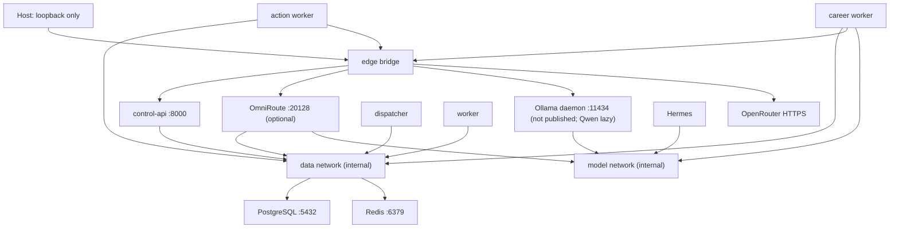

# Networking

## Published ports

| Service | Default host binding | Reason |
|---|---|---|
| Control API | `127.0.0.1:8080` | Local development interface |
| OmniRoute | `127.0.0.1:20128` | Optional onboarding/dashboard and API |
| PostgreSQL | none | Internal only |
| Redis | none | Internal only |
| Ollama | none | Internal model endpoint only |
| Mailpit | `127.0.0.1:8025` | Test profile only; captures email locally |

The Hermes upstream dashboard is not published until an upstream-supported
authentication provider is configured. `edge` provides intentional host binding
and outbound connectivity. `data` and `model` are `internal: true`. Dispatcher
and foundation worker have no outbound network. The career worker is the narrow
exception: it joins `edge` for allowlisted public job requests, `data` for
durable task/career/inference state, and `model` for local drafting. When
explicitly enabled, it also calls the fixed OpenRouter HTTPS origin. The Hermes
container receives the same inference-only key for its second fallback route
and has outbound access, but no data-plane network. OmniRoute bridges primary
model requests and its own Redis rate-limit state.

Ollama joins `edge` only for model downloads and `model` so Hermes/OmniRoute can
reach it; it receives no data-network access. Starting the daemon does not load
Qwen weights. No agent receives Docker-socket access to start containers on
demand.

The action worker joins `edge` and `data`: `edge` is needed for reviewed ATS or
configured SMTP endpoints, while `data` provides PostgreSQL/Redis. In-process
browser routing restricts implemented ATS actions to the initial allowlisted
host. Mailpit and the fake application form exist only in `side-effects-test`;
Mailpit's SMTP port is not published to the host.

## VPS evolution

On VPS, keep the control/dashboard port bound to loopback. Initially reach it
through WireGuard/Tailscale or an SSH tunnel. A later public HTTPS reverse proxy
requires OIDC/RBAC, rate limiting, and TLS; the private signed browser session is
not public-internet authentication. PostgreSQL and Redis must never bind public
interfaces. `vps-preflight.sh` renders the resolved Compose model privately and
refuses any declared published port that is not explicitly bound to
`127.0.0.1`, as well as host networking, privileged mode, or a Docker-socket
mount.
