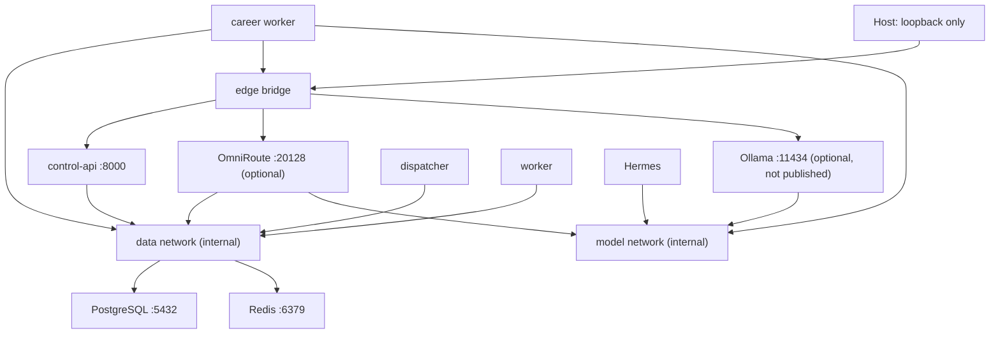

# Networking

## Published ports

| Service | Default host binding | Reason |
|---|---|---|
| Control API | `127.0.0.1:8080` | Local development interface |
| OmniRoute | `127.0.0.1:20128` | Optional onboarding/dashboard and API |
| PostgreSQL | none | Internal only |
| Redis | none | Internal only |
| Ollama | none | Internal model endpoint only |

The Hermes upstream dashboard is not published until an upstream-supported
authentication provider is configured. `edge` provides intentional host binding
and outbound connectivity. `data` and `model` are `internal: true`. Dispatcher
and foundation worker have no outbound network. The career worker is the narrow
exception: it joins `edge` for allowlisted public job requests, `data` for
durable task/career state, and `model` for local drafting. Hermes has outbound
access for eventual provider/tools but no data-plane network. OmniRoute bridges
model requests and its own Redis rate-limit state.

Ollama joins `edge` only for model downloads and `model` so Hermes/OmniRoute can
reach it; it receives no data-network access.

## VPS evolution

On VPS, keep the control/dashboard port bound to loopback. Initially reach it
through WireGuard/Tailscale or an SSH tunnel. A later public HTTPS reverse proxy
requires OIDC/RBAC, rate limiting, and TLS; the bootstrap bearer token alone is
not public-internet authentication. PostgreSQL and Redis must never bind public
interfaces.
