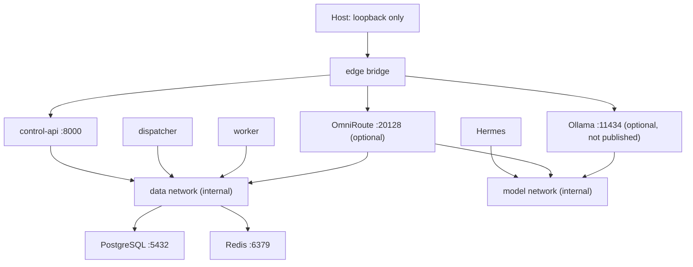

# Networking

## Published ports

| Service | Default host binding | Reason |
|---|---|---|
| Control API | `127.0.0.1:8080` | Local development interface |
| OmniRoute | `127.0.0.1:20128` | Optional onboarding/dashboard and API |
| PostgreSQL | none | Internal only |
| Redis | none | Internal only |
| Ollama | none | Internal model endpoint only |

Hermes dashboard is not published until an upstream-supported authentication
provider is configured. `edge` provides intentional host binding and outbound connectivity. `data` and
`model` are `internal: true`. Dispatcher and worker have no outbound network
during foundation phase. Hermes has outbound access for eventual provider/tools
but no data-plane network. OmniRoute bridges model requests and its own Redis
rate-limit state.

Ollama joins `edge` only for model downloads and `model` so Hermes/OmniRoute can
reach it; it receives no data-network access.

## VPS evolution

On VPS, remove direct dashboard host publishing. Put one authenticated HTTPS
reverse proxy on public ports 80/443, allow admin access through WireGuard or
SSH tunnels, and keep all current internal networks. PostgreSQL and Redis must
never bind public interfaces.
