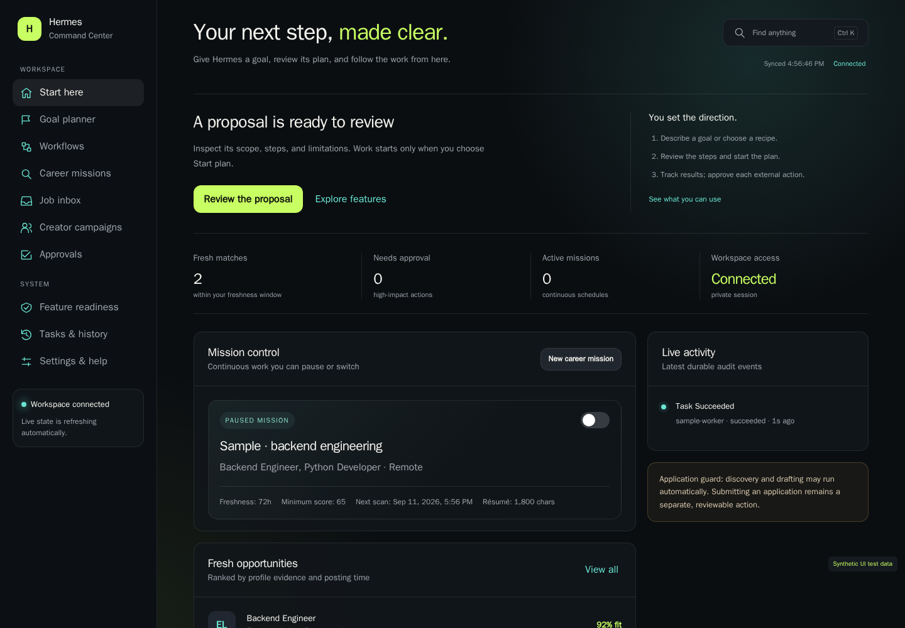

# Guided workspace and feature verification

Start with `./scripts/open-dashboard.ps1 -SideEffectsTest`. It starts the private
local workspace and signs in with a one-use fragment. Keep this tab private.
The dashboard is a single-operator local alpha, not a public multi-user service.



*Interface example with synthetic sample data; no private records are shown.*

## Choose your first outcome

| Page | What to do | What happens next |
|---|---|---|
| Start here | Follow the contextual next action | Pending approvals, ready proposals, running workflows, or fresh jobs take priority |
| Goal planner | Try the local demo or enter a goal and select its context | A proposal appears for review; no child work starts until adoption |
| Career missions | Add target roles, skills, sources, résumé, and optionally identity | Scan manually, then enable a bounded recurring schedule |
| Job inbox | Inspect evidence and shortlist a match | Draft, inspect the form, and review the exact proposed application |
| Creator campaigns | Create a campaign and review its promotion kit | Research YouTube fit and public business-contact candidates, inspect creative concepts, export a shortlist, and review outreach |
| Approvals | Inspect exact contents and destination | Approve or reject one action; each email/application needs its own approval |
| Feature readiness | Expand setup and evidence | See missing prerequisites and when a feature was actually checked |
| Tasks & history | Inspect results, errors, and audit events | Diagnose failures or request cancellation |

Use Ctrl/Cmd+K to search pages and common actions. On mobile, the labeled bottom
navigation includes a More menu. Page links use `#view=...`, support browser
back/forward, and contain no login credentials. Long mission and campaign forms
keep optional settings in expandable sections. Validation keeps your entered
values, and Close/Cancel never submits a form.

## Goal proposals

The model can select only opaque, server-declared action keys from context you
explicitly choose. Supported actions are job scanning, drafts and form inspections
for up to three selected jobs, creator discovery, and a harmless foundation check.
The compiler determines task kinds, IDs, payloads, dependencies, and result checks;
the model cannot supply executable code, URLs, recipients, or arbitrary tool calls.
Proposals contain at most eight sequential steps.

Review the goal, source, steps, and limitations. **Start plan** submits the exact
proposal digest. The server revalidates the selected context and policy, then
creates one durable workflow and records adoption in the same PostgreSQL
transaction. Retrying adoption returns the same workflow. A changed digest or
invalid context is rejected. No email or application submission is available to
the planner; those continue through the existing exact-action approval flow.

Model mode uses the existing free-only provider ledger and configured local
fallback. The local demo is explicitly labeled as a fixed template. An unsupported
goal is reported as unsupported; the system does not invent an implemented
capability or silently substitute a template for a failed model response.

## Reproducible local feature checks

```powershell
./scripts/feature-test.ps1 -PublishReport
./scripts/planning-smoke.ps1 -Live
./scripts/scheduler-smoke.ps1
```

The full feature runner covers the core lifecycle/workflows, disposable restore,
environment, configured OmniRoute/OpenRouter/Hermes/local Qwen paths, public job
discovery and drafting, local application/email fixtures, creator campaign
preparation/outcomes, one bounded YouTube request when configured, goal planning,
and scheduler failure/concurrency. Optional unconfigured paths are explicitly
skipped. The live planner probe retains synthetic task and usage-audit rows so
shared provider accounting remains truthful. Disposable database probes never
dispatch to a live Redis queue or touch user records.

`runtime/feature-tests/latest.json` is an ignored, atomically replaced report.
Publishing requires the operator bearer token, not a browser session, and stores
only fixed check IDs, status, durations, reason codes, timestamps, revision, dirty
state, and allowlisted booleans in PostgreSQL. Logs, exception messages, credentials,
résumés, contacts, and model prompts are excluded. Reports are operator attestations,
not signed artifacts or continuous health monitoring.

**Verified** means a relevant end-to-end check passed within 24 hours and the
recorded prerequisites are present. **Configured** means available setup without
fresh proof. **Needs setup** names a missing prerequisite. **Unavailable** marks a
roadmap integration. Expand evidence to see its timestamp. A successful fixture
check does not prove compatibility with every ATS or delivery through real SMTP.
Live external email still needs explicit owned-inbox validation after SMTP setup.

Scheduled career/creator scans now commit schedule advancement, task, audit, and
outbox together. A failed transaction preserves the due occurrence for the next
poll; concurrent workers use row locks to avoid issuing the same scan twice.

Migrations 011 and 012 add proposal and feature-evidence tables and record their
versions through the existing startup migration runner. They are additive and
idempotent. If rolling application code back, leave these tables and their audit
history in place; do not delete volumes or erase inference accounting. Already
adopted workflows remain under the existing workflow engine.
