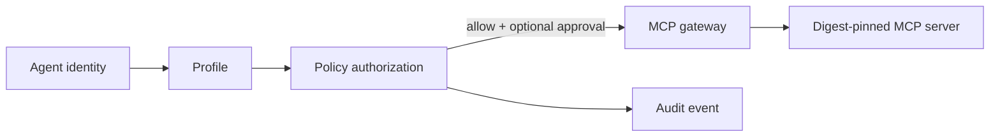

# MCP capability architecture

Files here are project policy source, not an automatically executable client
configuration. This prevents declarative intent from silently granting tools.

```text
registry.yaml            reviewed server/capability metadata
profiles/*.yaml          capabilities visible to each agent role
policies/permissions.yaml default-deny risk and approval rules
```

Runtime target:



Docker MCP Catalog is preferred for reviewed containerized servers, but its
Toolkit/Gateway is beta and host-managed. Foundation does not mount Docker
socket into Hermes or force host Toolkit state into Compose. A future renderer
will translate this registry into a reviewed Docker MCP profile and Hermes HTTP
configuration.

All entries start `enabled: false`. Enabling requires the gate in
[MCP security](../docs/security/mcp-security.md) and a journaled safe test.

